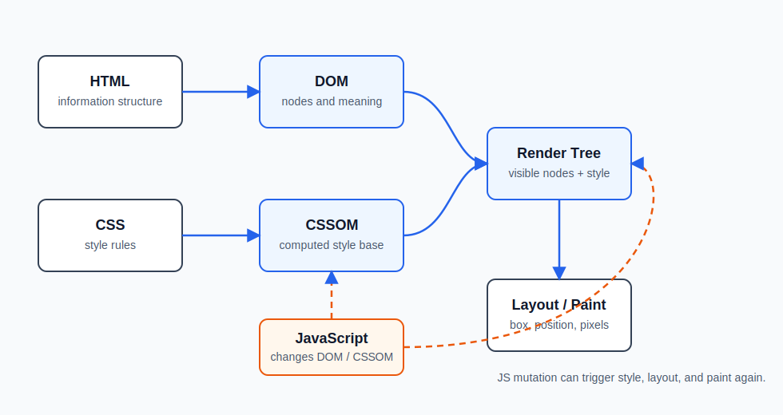
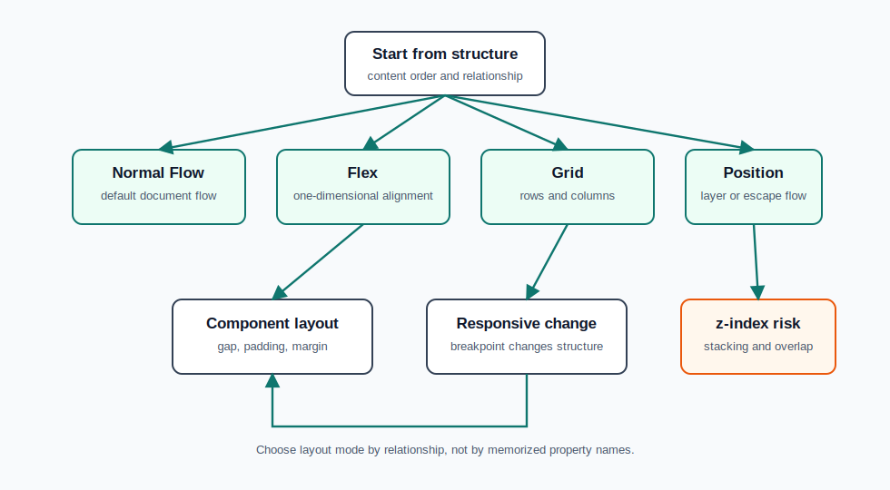
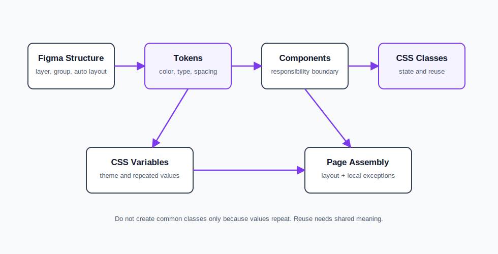
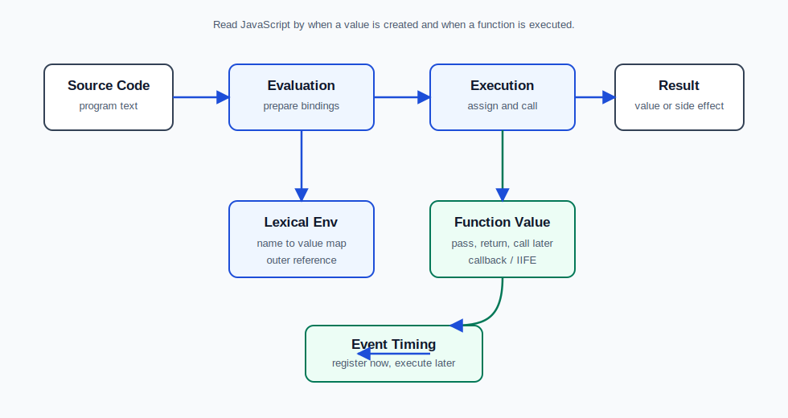
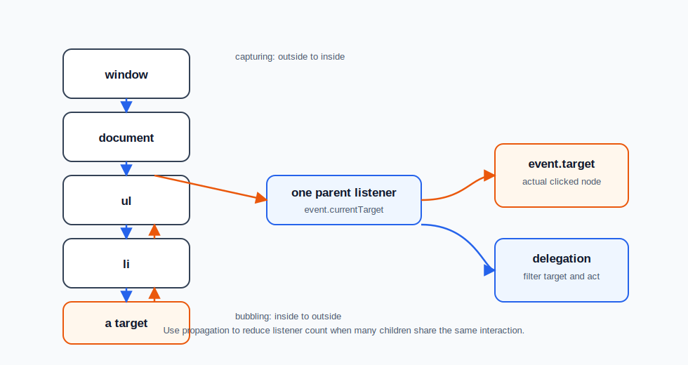

# [웹퍼블리싱 및 UI개발 기초] HTML/CSS/JavaScript 통합본

> HTML은 정보 구조를 만들고, CSS는 그 구조의 표현을 계산하며, JavaScript는 값과 DOM 상태와 이벤트 흐름을 실행 시점에 바꾼다.

## 1. 전체 흐름



브라우저는 HTML을 읽어 DOM을 만들고, CSS를 읽어 CSSOM을 만든다. DOM은 정보 구조이고, CSSOM은 표현 규칙이다. 두 구조가 결합되어 render tree가 되고, layout과 paint를 거쳐 화면이 된다.

JavaScript는 이 흐름 위에서 실행된다. `querySelector`로 DOM 객체를 찾고, `textContent`, `classList`, `style` 같은 속성이나 method를 통해 DOM/CSSOM에 영향을 준다. JS가 DOM이나 style을 바꾸면 브라우저는 필요한 범위에서 style 계산, layout, paint를 다시 수행할 수 있다.

면접 답변에서는 "HTML/CSS/JS를 각각 따로 외웠다"보다 다음 연결을 설명해야 한다.

- HTML: 어떤 정보가 어떤 의미와 계층을 갖는가
- CSS: 그 정보가 어떤 상자와 줄, 배치 규칙으로 계산되는가
- JavaScript: 어떤 값과 DOM 상태가 언제 만들어지고 바뀌는가
- 실무 판단: 의미, 접근성, 유지보수, 성능, 보안 중 무엇을 우선해야 하는가

## 2. HTML 정리

HTML의 핵심은 화면에 보이는 모양이 아니라 정보 구조다. 같은 글자를 `div`로 감쌀 수도 있고 `h1`, `button`, `a`, `img`, `section`으로 표현할 수도 있지만, 브라우저와 검색엔진과 보조 기술이 읽는 의미는 달라진다.

`doctype`은 브라우저가 표준 모드로 문서를 해석하게 하는 선언이다. 이 선언이 없거나 잘못되면 브라우저가 호환 모드로 동작할 수 있고, CSS 계산 결과가 예상과 달라질 수 있다.

제목 구조는 `h1`을 크게 보이게 만드는 문제가 아니다. 문서에서 무엇이 최상위 주제이고, 어떤 내용이 그 하위 주제인지 드러내는 구조다. `h1`은 보통 페이지의 핵심 주제를 대표하고, `h2`, `h3`는 내용의 계층을 만든다.

시맨틱 태그는 SEO만을 위한 장식이 아니다. `button`은 클릭 가능한 명령이고, `a`는 이동 가능한 링크이며, `img`는 문서의 의미 있는 이미지다. 클릭 동작이 있으면 시각적으로 링크처럼 보여도 실제 역할이 명령인지 이동인지 먼저 판단해야 한다.

`block`과 `inline`은 기본 배치 참여 방식이다. block은 줄 전체의 흐름을 만들고, inline은 line box 안에서 텍스트와 함께 배치된다. 이미지 아래에 의도하지 않은 여백이 생기는 이유도 `img`가 기본적으로 inline 흐름에 참여하기 때문이다.

이미지는 의미에 따라 선택한다. 콘텐츠로서 사용자에게 전달해야 하는 이미지는 `img`가 적합하고, 장식이나 상태 표현은 `background-image`가 적합할 수 있다. 접근성, 대체 텍스트, 로딩, 크기 계산이 달라지므로 단순히 "보이게 된다"로 판단하면 안 된다.

HTML 면접에서 자주 약한 답변은 "태그는 화면을 만드는 도구"로 끝나는 답변이다. 더 좋은 답변은 "태그는 정보의 의미와 관계를 만들고, CSS와 JS가 그 구조를 기준으로 동작한다"까지 연결하는 것이다.

## 3. CSS 정리

CSS는 HTML에 색과 크기를 칠하는 언어가 아니라 CSSOM을 구성하고 수정하는 언어다. 브라우저는 선택자와 선언을 읽고 각 DOM 요소에 어떤 style이 적용되는지 계산한다.

Cascade는 여러 CSS 규칙이 같은 속성을 지정했을 때 어떤 값이 최종 값이 되는지 결정하는 규칙이다. 선택자 구체성, 선언 순서, 상속, user agent stylesheet, reset CSS가 모두 결과에 영향을 준다.

상속은 모든 속성에 적용되지 않는다. 글꼴, 색상처럼 텍스트 성격의 속성은 상속되는 경우가 많지만, margin, padding, border 같은 box model 속성은 보통 상속되지 않는다. 기본 타이포그래피는 상속으로 내려도 되지만, 레이아웃 치수는 필요한 요소에 명확히 지정해야 한다.

Box model은 `content`, `padding`, `border`, `margin`의 관계다. `width: 100%`에 padding과 border가 더해지면 부모보다 커질 수 있고, 이 문제를 줄이기 위해 `box-sizing: border-box`를 자주 사용한다.

`height`는 기본적으로 콘텐츠에 의해 자동 계산된다. 콘텐츠보다 작은 높이를 강제로 주면 overflow가 발생할 수 있다. `overflow: hidden`은 넘친 부분을 잘라 UI를 깔끔하게 만들 수 있지만, 필요한 콘텐츠나 focus outline까지 숨길 수 있다.

Margin collapse는 block 흐름에서 인접한 vertical margin이 합쳐지는 현상이다. 단순 계산 오류가 아니라 normal flow의 일부다. BFC(Block Formatting Context)를 만들면 float, margin collapse, 외부 요소와의 관계가 달라질 수 있다.

타이포그래피는 `font-size`만으로 끝나지 않는다. `line-height`는 line box 높이에 영향을 주고, 단위 없는 `line-height`는 상속될 때 비율로 계산되어 재사용성이 좋다. `rem`은 root font-size를 기준으로 하므로 전체 스케일 관리에 유리하다.

Web font는 브랜드와 시각 품질을 높이지만 네트워크 요청, 렌더링 지연, fallback 문제를 만든다. 성능과 표현 품질을 함께 보고 선택해야 한다.

## 4. Layout 정리



레이아웃은 property 암기가 아니라 배치 세계를 선택하는 문제다. 기본은 normal flow이며, 필요할 때 flex, grid, position, media query를 선택한다.

Flex는 한 방향의 정렬과 분배에 강하다. 탭 목록, 카드 내부 요소, 아이콘과 텍스트 정렬처럼 한 축의 관계가 중요할 때 적합하다. `justify-content`는 main axis, `align-items`는 cross axis를 기준으로 읽는다.

Grid는 행과 열이 모두 중요한 2차원 구조에 적합하다. 부모가 `grid-template-columns`, `grid-template-rows`로 격자를 만들고, item은 자동 배치되거나 선 번호로 배치될 수 있다. 단순 가로 정렬만 필요한데 grid를 쓰면 구조가 과해질 수 있다.

Position은 normal flow에서 벗어나거나 기준 사각형을 바꾸는 배치 층이다. `relative`는 자기 원래 위치를 기준으로 이동하고, `absolute`는 기준이 되는 positioned ancestor를 찾으며, `fixed`는 viewport를 기준으로 고정된다.

`absolute`를 쓸 때 부모에 `position: relative`를 주는 이유는 화면에 영향을 주려는 것이 아니라 기준 사각형을 명시하기 위해서다. 기준이 없으면 예상하지 못한 상위 요소나 viewport를 기준으로 배치될 수 있다.

`z-index`는 단순 숫자 경쟁이 아니라 stacking context 안에서 작동한다. 떠 있는 UI, header, modal, tooltip 같은 요소는 겹침 순서와 클릭 가능 영역까지 함께 점검해야 한다.

Responsive web은 화면 크기에 따라 CSS를 조금 바꾸는 정도가 아니다. viewport, CSS pixel, content density, 입력 방식, 그리드 열 수, component 배치까지 같이 바뀐다. Media query는 구조 변화가 필요한 지점에 쓰는 것이 좋다.

좋은 레이아웃 답변은 "flex를 쓰면 됩니다"가 아니라 "한 축 정렬이면 flex, 행/열 격자면 grid, 흐름에서 떠야 하면 position, 구조가 바뀌는 지점이면 media query를 선택한다"로 이어진다.

## 5. Design System과 퍼블리싱 구조



Figma를 코드로 옮길 때 중요한 것은 수치를 그대로 복사하는 일이 아니다. 레이어 구조, 그룹 관계, 반복되는 부품, 상태, token화할 값과 지역적으로만 쓸 값을 구분해야 한다.

Design token은 반복되는 값을 이름으로 관리하는 장치다. 색상, spacing, typography처럼 여러 곳에서 같은 의미로 쓰이는 값은 token이나 CSS variable로 관리할 수 있다. 하지만 우연히 값이 같다는 이유만으로 공통 token을 만들면 의미가 다른 값이 묶여 수정이 어려워진다.

CSS variable은 theme, dark mode, 반복 색상, 기준 spacing을 관리할 때 유리하다. 변수 이름은 `--blue-500`처럼 색 자체를 말할 수도 있지만, 실무에서는 `--color-primary`, `--surface-card`, `--text-muted`처럼 역할을 드러내는 이름이 더 오래 버틴다.

Component는 자기 내부의 구조와 상태를 책임진다. 반면 component 바깥의 간격은 부모 layout이 책임지는 경우가 많다. 카드 자체가 모든 margin을 들고 있으면 다른 화면에 재사용할 때 간격 충돌이 생긴다.

공통 class는 "중복을 없애기 위해"가 아니라 "같은 의미와 같은 책임을 공유하기 위해" 만든다. 같은 `display: flex`가 반복되어도 서로 다른 이유로 쓰인다면 억지로 공통 class를 만들지 않는 편이 낫다.

Figma의 Auto Layout과 CSS의 normal flow/flex/grid는 완전히 같은 모델이 아니다. Figma 수치는 참고하되, 실제 HTML 구조와 브라우저 계산 기준으로 다시 읽어야 한다.

## 6. JavaScript 실행 모델



JavaScript는 위에서 아래로 실행되는 것처럼 보이지만, 실행 전에 평가 단계가 있다. 평가 단계에서는 실행 컨텍스트와 렉시컬 환경이 준비되고, 실행 단계에서는 실제 대입과 함수 호출이 일어난다.

표현식(expression)은 값을 만든다. 문(statement)은 실행 흐름을 만든다. 블록(block)은 문을 묶고, 함수(function)는 실행 단위를 값처럼 다룰 수 있게 만든다.

렉시컬 환경은 이름과 값을 연결하는 구조다. 식별자를 만나면 현재 환경에서 먼저 찾고, 없으면 outer environment reference를 따라 바깥 환경으로 이동한다. 스코프는 단순히 "밖에서 안 보인다"가 아니라 "어떤 환경부터 이름을 찾는가"의 문제다.

호이스팅은 이상한 예외가 아니라 평가 단계에서 무엇이 먼저 준비되는지의 결과다. Function Declaration은 평가 단계에서 함수 객체까지 준비될 수 있지만, Function Expression은 변수에 함수 값을 대입하는 실행 단계가 지나야 안전하게 사용할 수 있다.

함수 이름만 쓰면 함수 값이고, `()`를 붙이면 호출 결과다. callback, event handler, IIFE, 함수 반환 패턴은 모두 이 기준으로 읽어야 한다.

```js
function c() {
  return function () {
    return "done";
  };
}

const result = c()();
```

`c()`는 내부 함수를 반환하고, 뒤의 `()`는 반환된 함수를 다시 실행한다. 이런 코드는 괄호가 어느 함수에 붙었는지와 각 호출의 반환값이 무엇인지 끊어서 읽어야 한다.

이벤트 처리도 같은 원리 위에 있다. `addEventListener("click", handler)`는 지금 handler를 실행하는 것이 아니라 브라우저에게 나중에 실행할 함수 값을 등록하는 것이다.

## 7. JavaScript 값과 자료구조

JavaScript의 변수는 타입을 고정하는 그릇이 아니라 값을 가리키는 이름에 가깝다. 값의 종류에 따라 가능한 연산, 비교 방식, method 사용 방식이 달라진다.

`const`는 값 자체를 얼리는 문법이 아니라 binding을 고정한다. 객체나 배열을 `const`로 선언해도 내부 property나 element는 바뀔 수 있다.

```js
const user = { name: "kim" };
user.name = "lee"; // binding은 그대로, 객체 내부 값은 변경
```

truthy/falsy는 조건 판단에서 값이 boolean처럼 해석되는 기준이다. `false`, `0`, `""`, `null`, `undefined`, `NaN`은 falsy이고, 나머지 많은 값은 truthy다.

`&&`, `||`는 항상 boolean을 반환하는 연산자가 아니다. 조건 판단 과정에서 operand 자체를 반환한다. 그래서 기본값 처리, fallback 선택, 조건부 실행에 자주 쓰이지만, 값 선택 흐름을 모르면 버그를 만들기 쉽다.

객체는 동적 property 저장소에 가깝다. 점 접근과 bracket 접근은 모두 property를 찾는 방식이고, property 이름이 변수에 들어 있거나 동적으로 정해질 때는 bracket 접근이 필요하다.

배열은 순서가 있는 값 묶음이지만 JavaScript에서는 객체 계열 값이다. `Array.isArray()`로 실제 배열인지 확인할 수 있고, `NodeList`처럼 배열처럼 보이는 값과 실제 배열은 구분해야 한다.

배열 method는 원본 변경 여부를 먼저 본다.

- `concat`, `slice`: 새 배열을 만들고 원본을 유지하는 쪽
- `splice`, `push`, `pop`, `shift`, `unshift`: 원본 배열을 바꾸는 쪽
- `indexOf`: 찾으면 index, 없으면 `-1`

비교에서는 `===`를 기본으로 둔다. `==`는 자동 형 변환을 수행하므로 짧은 예제에서는 편해 보여도 업무 코드에서는 의도를 흐리기 쉽다. 객체, 배열, 함수는 내용이 아니라 참조를 비교한다.

## 8. DOM과 Event



DOM API는 주문처럼 외우기보다 JavaScript 기본 원리로 읽어야 한다. `querySelector`는 DOM 객체 하나를 반환하고, `querySelectorAll`은 여러 DOM 객체 묶음인 `NodeList`를 반환한다.

```js
const items = document.querySelectorAll("#service li");

for (let i = 0; i < items.length; i += 1) {
  items[i].classList.add("active");
}
```

여러 요소를 다룰 때는 index를 직접 나열하지 말고 반복문과 `length`를 사용한다. 요소 개수가 바뀌어도 같은 흐름으로 처리되기 때문이다.

JS로 직접 style을 쓰는 것은 가능하지만, 표현 규칙이 JS에 많이 들어오면 유지보수가 어렵다. UI 상태는 `classList.add`, `classList.remove`, `classList.toggle`로 표현하고, 실제 색과 모양은 CSS가 담당하는 구조가 좋다.

`className`은 class 문자열 전체를 대입한다. 기존 class를 덮어쓸 수 있으므로 class 하나를 다룰 때는 `classList`가 더 안전하다.

DOM 생성은 두 방식으로 나눠 본다. `createElement`, `setAttribute`, `appendChild`는 노드를 명시적으로 조립한다. `insertAdjacentHTML`은 HTML 문자열을 지정한 위치에 삽입한다.

```js
listEl.insertAdjacentHTML("beforeend", `<li><a href="${href}">${label}</a></li>`);
```

`insertAdjacentHTML`은 짧고 편하지만 문자열 삽입 방식이다. 외부 입력이나 사용자 입력을 그대로 넣으면 XSS 같은 보안 문제가 생길 수 있으므로 신뢰 경계가 중요하다.

이벤트 객체는 사건의 정황을 담는다. `event.target`은 실제 이벤트가 발생한 요소이고, `event.currentTarget`은 listener가 붙어 있는 요소다. `preventDefault()`는 브라우저 기본 동작을 막는다.

이벤트는 capturing, target, bubbling 단계를 거친다. 이 흐름을 이용하면 여러 자식마다 listener를 붙이지 않고 공통 부모에 하나만 붙여 처리할 수 있다. 카드, 썸네일, 리스트처럼 반복 UI가 많을 때 listener 개수는 성능과 구조에 영향을 준다.

## 9. 실무 판단 기준

| 판단 지점                   | 기본 기준                                   | 주의할 점                                                |
| --------------------------- | ------------------------------------------- | -------------------------------------------------------- |
| `img` vs `background-image` | 의미 있는 콘텐츠는 `img`, 장식은 background | `img`는 대체 텍스트와 문서 의미에 관여한다               |
| Sprite image                | 요청 수를 줄일 수 있다                      | 개별 수정과 좌표 관리 비용이 커진다                      |
| Web font                    | 브랜드와 시각 품질을 높인다                 | 네트워크, fallback, 렌더링 지연을 확인한다               |
| Reset CSS                   | 브라우저 기본 스타일 차이를 줄인다          | 모든 기본값을 무조건 없애면 접근성 단서가 사라질 수 있다 |
| `overflow: hidden`          | 카드 모서리와 넘침을 쉽게 정리한다          | 콘텐츠, 그림자, focus outline이 잘릴 수 있다             |
| Flex/Grid                   | 관계에 맞는 layout mode를 선택한다          | property를 외워서 남용하면 구조가 흐려진다               |
| `position: absolute`        | flow에서 벗어난 레이어에 쓴다               | 기준 사각형과 겹침 순서를 명확히 해야 한다               |
| JS direct style             | 빠르게 한 속성을 바꿀 수 있다               | 표현 책임이 JS로 섞인다                                  |
| `classList`                 | UI 상태를 class token으로 다룬다            | 상태 이름이 의미를 가져야 한다                           |
| `insertAdjacentHTML`        | 짧게 DOM 조각을 삽입한다                    | 신뢰되지 않은 문자열을 넣으면 위험하다                   |
| Event delegation            | listener 개수를 줄일 수 있다                | target filtering과 HTML 구조가 필요하다                  |

실무 답변은 장점만 말하면 약하다. 어떤 선택이 성능, 유지보수, 접근성, 보안 중 무엇을 얻고 무엇을 희생하는지까지 말해야 한다.

## 10. 면접 질문/답변

### HTML

**Q1. Semantic tag를 쓰는 이유는 무엇인가?**
화면 모양이 아니라 문서의 의미와 관계를 브라우저, 검색엔진, 보조 기술에 전달하기 위해서다. CSS/JS도 이 구조를 기준으로 선택하고 조작한다.

**Q2. `h1`은 왜 중요한가?**
문서의 최상위 주제를 나타내는 구조이기 때문이다. 글자 크기보다 heading 계층과 페이지 주제 전달이 중요하다.

**Q3. `button`과 `a`는 어떻게 구분하는가?**
명령 실행이면 `button`, 위치 이동이면 `a`가 기본이다. 클릭 가능하다는 시각 형태만으로 고르면 접근성과 기본 동작이 어긋난다.

**Q4. `img`와 `background-image`는 어떻게 선택하는가?**
콘텐츠 의미가 있고 대체 텍스트가 필요하면 `img`, 장식이나 상태 표현이면 `background-image`가 적합하다.

### CSS

**Q5. CSSOM이란 무엇인가?**
CSS 규칙을 브라우저가 계산 가능한 객체 구조로 만든 것이다. DOM과 CSSOM이 결합되어 화면 렌더링의 기반이 된다.

**Q6. `box-sizing: border-box`를 쓰는 이유는 무엇인가?**
width 계산에 padding과 border를 포함해 요소의 실제 차지 크기를 예측하기 쉽게 만들기 위해서다.

**Q7. Margin collapse는 버그인가?**
버그가 아니라 normal flow에서 vertical margin이 합쳐지는 규칙이다. 필요하면 BFC나 padding/border 등으로 관계를 바꾼다.

**Q8. 단위 없는 `line-height`가 유리한 이유는 무엇인가?**
상속될 때 고정 px 값이 아니라 비율로 계산되어 요소별 font-size 변화에 더 안정적으로 대응한다.

**Q9. Reset CSS는 왜 쓰는가?**
브라우저 기본 스타일 차이를 줄여 일관된 출발점을 만들기 위해서다. 다만 focus나 list marker 같은 의미 있는 기본값까지 무조건 제거하면 안 된다.

### Layout / Design System

**Q10. Flex와 Grid는 어떻게 구분하는가?**
한 축 정렬과 분배가 핵심이면 flex, 행과 열이 함께 중요한 격자 구조면 grid가 적합하다.

**Q11. `absolute` 배치에서 부모에 `relative`를 주는 이유는 무엇인가?**
자식의 absolute 기준 사각형을 명시하기 위해서다. 부모를 움직이려는 목적이 아니다.

**Q12. Media query는 언제 쓰는가?**
화면 크기 변화로 layout 구조나 정보 밀도가 바뀌어야 할 때 쓴다. 단순 미세 조정보다 구조 변화 지점이 기준이다.

**Q13. Design token은 언제 만드는가?**
값이 반복될 뿐 아니라 같은 의미로 공유될 때 만든다. 값이 같아도 의미가 다르면 지역 값으로 두는 편이 낫다.

**Q14. Component의 margin은 누가 책임지는가?**
component 내부 간격은 component가 책임지고, component 바깥 배치는 부모 layout이 책임지는 경우가 많다.

### JavaScript

**Q15. Expression과 statement의 차이는 무엇인가?**
Expression은 값을 만들고, statement는 실행 흐름을 만든다. 코드를 읽을 때 어떤 값이 남는지와 어떤 일이 실행되는지를 구분해야 한다.

**Q16. 평가 단계와 실행 단계는 왜 구분해야 하는가?**
호이스팅, TDZ, 함수 선언문/표현식 차이, 스코프 준비 과정을 설명할 수 있기 때문이다.

**Q17. 함수 이름과 함수 호출은 어떻게 다른가?**
함수 이름만 쓰면 함수 값이고, `()`를 붙이면 호출 결과다. callback과 event handler 등록에서 이 차이가 중요하다.

**Q18. `const`는 값을 불변으로 만드는가?**
아니다. `const`는 binding을 고정한다. 객체나 배열 내부 값은 바뀔 수 있다.

**Q19. `==`보다 `===`를 기본으로 쓰는 이유는 무엇인가?**
`==`는 자동 형 변환으로 의도하지 않은 비교 결과를 만들 수 있다. 타입 변환이 필요하면 비교 전에 명시적으로 하는 편이 안전하다.

### DOM / Event

**Q20. `querySelector`와 `querySelectorAll`의 차이는 무엇인가?**
`querySelector`는 첫 번째 DOM 객체 하나를 반환하고, `querySelectorAll`은 여러 객체 묶음인 `NodeList`를 반환한다.

**Q21. JS로 style을 직접 바꾸는 것보다 class를 바꾸는 것이 나은 이유는 무엇인가?**
JS는 상태 변경만 담당하고, 표현은 CSS가 담당하게 분리할 수 있기 때문이다. 디자인 수정 시 JS 로직을 덜 건드린다.

**Q22. `className`보다 `classList`가 나은 경우는 언제인가?**
class 하나를 추가, 제거, 토글할 때다. 문자열 전체를 덮어쓰지 않아 기존 class와 충돌할 위험이 줄어든다.

**Q23. `preventDefault()`는 언제 필요한가?**
브라우저 기본 동작을 막아야 할 때 필요하다. 예를 들어 `a` 클릭 시 페이지 이동 대신 현재 화면에서 JS 처리만 하고 싶을 때 사용한다.

**Q24. Event delegation의 장점은 무엇인가?**
반복되는 자식 요소마다 listener를 붙이지 않고 공통 부모에서 처리할 수 있어 listener 개수와 동적 요소 처리 비용을 줄일 수 있다.

## 11. 날짜별 회수표

| 날짜                | 회수 포인트                                                                  |
| ------------------- | ---------------------------------------------------------------------------- |
| [05.07](./05.07.md) | HTML 의미 구조, 렌더링 흐름, inline/block, image tag와 성능 관점             |
| [05.08](./05.08.md) | CSSOM, box model, class/id, 선택자, Figma와 코드 구조 연결                   |
| [05.11](./05.11.md) | 상속, width 계산, margin collapse, BFC, typography, background/image         |
| [05.12](./05.12.md) | 이미지 형식, flex 선택 기준, 디자인 토큰, CSS variable, component식 퍼블리싱 |
| [05.13](./05.13.md) | 카드 UI, 부품 책임 분리, 상태/장식 이미지, reset, overflow tradeoff          |
| [05.20](./05.20.md) | grid, position, z-index, responsive web, media query                         |
| [05.21](./05.21.md) | JS 실행 모델, 평가/실행, 스코프, 함수 값, IIFE, DOM 이벤트                   |
| [05.22](./05.22.md) | truthy/falsy, short-circuit, `const` binding, object property, array-like    |
| [05.26](./05.26.md) | 배열 method, DOM/CSSOM 조작, `classList`, DOM 생성, 이벤트 객체와 위임       |
